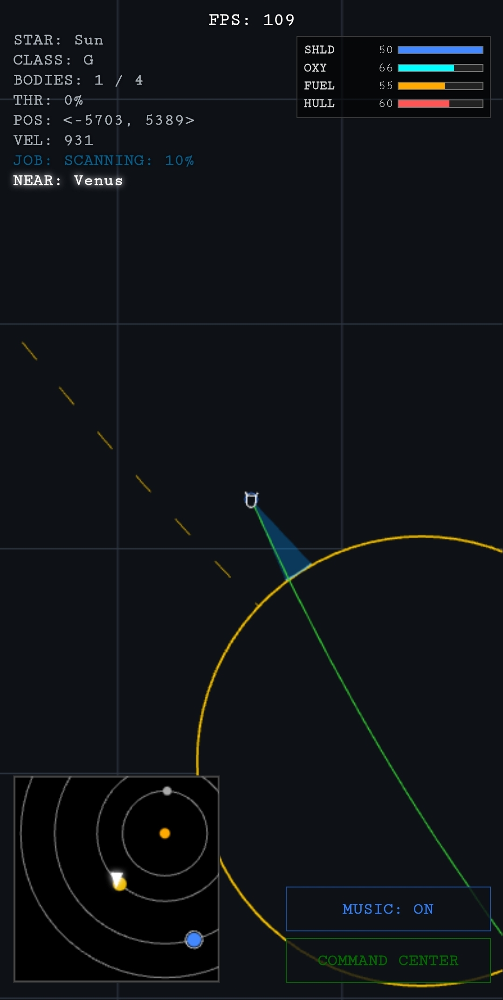

# **Landroid: Solar Neighborhood Explorer**

[Play Landroid](https://oren64.github.io/Landroid/) 

​Landroid is a physics-based space exploration and survival simulation. Navigate the vast "Solar Neighborhood," a network of procedurally generated star systems where survival depends on your ability to master orbital gravity, manage critical life support, and outmaneuver pirate threats.

__Best played on mobile__

**🚀 Key Gameplay Mechanics**

**🪐 Physics & Orbital Navigation**

​Variable Gravity Wells: Experience dynamic gravitational forces that scale based on your distance from stars and planets. Every celestial body pulls on your ship, requiring precise thrust management to maintain orbit or perform a safe descent.
​Speed-Sensitive Landings: Touchdown requires more than just reaching the surface. You must deploy landing gear and manage your vertical velocity; high-speed impacts will cause structural hull damage or total ship loss.
​Atmospheric Re-entry: Different planet types (Habitable, Gas Giants, Barren) affect your ship's status. Landing on oxygen-rich "Blue" planets is the only way to naturally replenish your life support systems.

​**🌌 Interstellar Exploration**

​The Command Center: Utilize the Galaxy Map to visualize your position within the Solar Neighborhood. Each star system is categorized by Star Class (G-type, Red Dwarfs, etc.), dictating the types of planets and resources found within.
​Warp Drive & Navigation: Moving between star systems is not free. You must mine or trade for Warp Quartz to power your jumps across the galaxy.
​Resource Siphoning: Master the art of "skimming"—hovering in the upper layers of Gas Giants to siphon fuel directly into your tanks while fighting the planet's massive gravitational pull.

**🛠️ Industry & Economy**

​The Job Board: Visit Trade Hubs (Blue Markers) to accept mercenary contracts or transport jobs. Completing these missions earns Credits (CR) required for ship maintenance.
​Mining & Salvage: Extract raw materials including Iron, Copper, Aluminum, Titanium, Gold, and Quartz.
​Emergency Field Repairs: If your hull drops below 50% in deep space, you can use your raw material inventory to perform "Spread Repairs," utilizing different metals to patch structural integrity on the fly.

​**⚔️ Combat & Survival**

​Pirate Ambushes: The void is not empty. Random pirate encounters force you to make a choice: pay a steep credit ransom or raise Battle Stations.
​Ship Customization: Visit Shipyards (Green Markers) to overhaul your vessel:
​Offense: Upgrade cannon fire rate, damage, and multi-shot arrays.
​Defense: Boost Shield (SHLD) capacity to absorb kinetic impacts.
​Utility: Expand Fuel and Oxygen reservoirs for longer deep-space treks.
​Boss Encounters: Face off against Pirate Motherships in high-stakes tactical battles for massive credit rewards and rare loot.

**🛠 Tech Specs**

​Engine: Custom-built 2D physics and rendering engine.
​Architecture: Zero-dependency single-file deployment.
​Interface: Retro-inspired HUD with real-time telemetry (VEL, POS, THR).

Music by Kevin MacLeod
